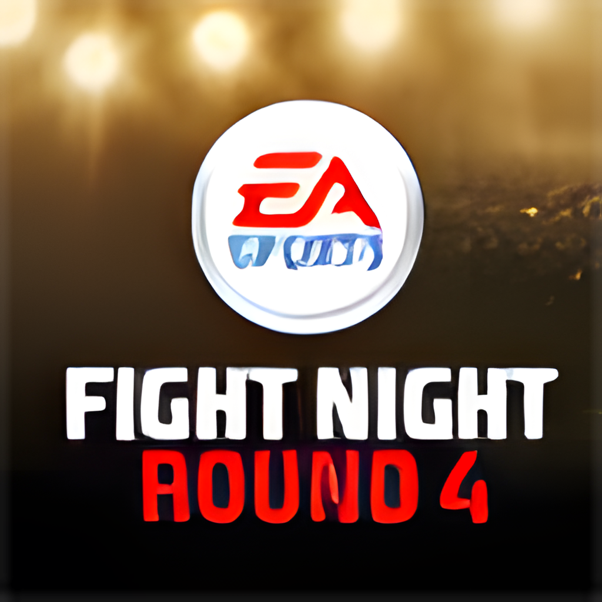

<p align="center">
  
</p>

<h1 align="center">Fight Night Round 4</h1>

<p align="center">
  Native PC static recompilation of the Xbox 360 version, built on the
  <a href="../README.md">fightNightRecomped</a> framework and ReXGlue.
</p>

## Game

| | |
| --- | --- |
| Developer | EA Canada |
| Publisher | Electronic Arts (EA SPORTS) |
| Series | Fight Night |
| Platform recompiled | Xbox 360 |
| Released | June 2009 |
| Genre | Sports, boxing |
| Achievements | 33 |

## Regions

| Region | Serial | Status |
| --- | --- | --- |
| 🇺🇸 🇪🇺 USA, Europe | `EA-2196` | ✅ Tested (the disc below) |
| 🇯🇵 Japan | `EA-2196` | ⬜ Not tested |

Only the tested disc's `default.xex` has been recompiled. Other regional
executables are likely to differ and may need their own codegen pass.
Region list from [Redump](http://redump.org/discs/system/xbox360/).

## Disc

| | |
| --- | --- |
| Region | 🇺🇸 🇪🇺 USA, Europe |
| Title ID | `45410894` |
| Languages | English, French, German |
| Contents | 63 files, 4,479,852,378 bytes |
| Executable | `default.xex`, 16,723,968 bytes |
| DLL modules | None |

## Status

| Area | State |
| --- | --- |
| Boot, audio, shader compilation | Working |
| Gameplay | Plays |
| Stability | One access violation (read of guest `0x00000020`) seen once about 35 seconds in; not reproduced since |
| Controllers | Working through SDL |
| DLC | Installer in place (see the [root README](../README.md#dlc)); no packages tested |
| Xbox PC app, UWP builds | Configured, not yet tested |
| Linux, macOS, Steam Deck | Builds expected, not play-tested |

## Getting started

1. Build from the repository root:
   `.\scripts\build.ps1 -Game fightNight4` or `./scripts/build.sh fightNight4`.
2. Launch `Fight Night Round 4`. On first run choose your Xbox 360 ISO; the
   files are extracted once.
3. Open the system menu with **View + Menu** (or **Esc**) for Settings and Exit.

## Default settings

`settings/fight_night_round_4.toml` starts from the NBA LIVE settings (`rov` /
`fsi` render target paths, no background pipeline creation, 60 Hz vsync).
Whether this game needs each of them has not been tested separately.

## Recompilation notes

| | |
| --- | --- |
| Function seeds | 521 in `config/functions.toml` |
| Disabled seeds | 85 in `config/disabled_function_seeds.txt` (they split functions or loops) |
| Kernel stubs | Xbox Live Vision camera, shared from `common/src/kernel` |
| Known codegen warnings | Four functions exceed `max_file_size_bytes`; they compile |

The full log of what was found and fixed is in [docs/NOTES.md](docs/NOTES.md).

## Xbox Developer Mode (UWP)

```powershell
.\scripts\build.ps1 -Game fightNight4 -Preset win-amd64-uwp-release
.\scripts\package_uwp.ps1 -Game fightNight4 -Register
.\scripts\package_uwp.ps1 -Game fightNight4 -Pack
```

## Artwork

`docs/icon.png` is the title image from `default.xex`, upscaled to 1024x1024.
To regenerate the exe icon and Xbox app images locally:

1. `rexglue init --project-name fight_night_round_4 --xex-path assets\default.xex achievements assets\default.xex metadata`
2. Upscale `metadata/icons/title.png` 4x twice with Real-ESRGAN
   (`realesrgan-x4plus`) to `metadata/gdk_hd/title_1024.png`, or copy
   `docs/icon.png` there.
3. `.\scripts\generate_artwork.ps1 -Game fightNight4 -ProjectName fight_night_round_4`

## Legal

Not affiliated with or endorsed by Electronic Arts or Microsoft. Fight Night and
EA SPORTS are trademarks of Electronic Arts. You must own the game.
