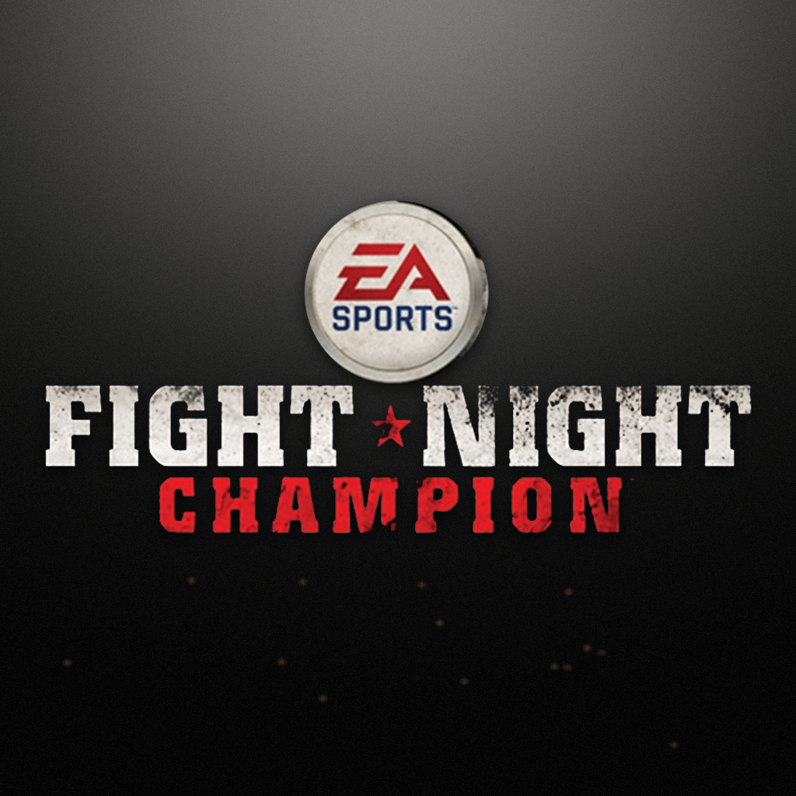

<p align="center">
  
</p>

<h1 align="center">Fight Night Champion</h1>

<p align="center">
  Native PC static recompilation of the Xbox 360 version, built on the
  <a href="../README.md">fightNightRecomped</a> framework and ReXGlue.
</p>

## Game

| | |
| --- | --- |
| Developer | EA Canada |
| Publisher | Electronic Arts (EA SPORTS) |
| Series | Fight Night |
| Platform recompiled | Xbox 360 |
| Released | March 2011 |
| Genre | Sports, boxing |
| Achievements | 44 |

## Regions

| Region | Serial | Status |
| --- | --- | --- |
| 🇺🇸 🇪🇺 USA, Europe | `EA-2325` | ✅ Tested (the disc below) |

Only the tested disc's `default.xex` has been recompiled. Other regional
executables are likely to differ and may need their own codegen pass.
Region list from [Redump](http://redump.org/discs/system/xbox360/).

## Disc

| | |
| --- | --- |
| Region | 🇺🇸 🇪🇺 USA, Europe |
| Title ID | `45410915` |
| Languages | English, French, German |
| Contents | 187 files, 5,720,903,576 bytes |
| Executable | `default.xex`, 16,887,808 bytes |
| DLL modules | None |

## Status

| Area | State |
| --- | --- |
| Boot, audio, shader compilation | Working |
| Idle stability | Running and responsive after a minute, no fatal errors |
| Gameplay | Not yet played |
| Audio | `XMA: Write to unknown register (0601)` repeats at debug level; no audible problem seen yet |
| Controllers | Working through SDL |
| DLC | Installer in place (see the [root README](../README.md#dlc)); no packages tested |
| Xbox PC app, UWP builds | Configured, not yet tested |
| Linux, macOS, Steam Deck | Builds expected, not play-tested |

## Getting started

1. Build from the repository root:
   `.\scripts\build.ps1 -Game fightNightChampion` or
   `./scripts/build.sh fightNightChampion`.
2. Launch `Fight Night Champion`. On first run choose your Xbox 360 ISO; the
   files are extracted once.
3. Open the system menu with **View + Menu** (or **Esc**) for Settings and Exit.

## Default settings

`settings/fight_night_champion.toml` starts from the NBA LIVE settings (`rov` /
`fsi` render target paths, no background pipeline creation, 60 Hz vsync).
Whether this game needs each of them has not been tested separately.

## Recompilation notes

| | |
| --- | --- |
| Function seeds | 1,367 in `config/functions.toml` |
| Disabled seeds | 5 in `config/disabled_function_seeds.txt` (they split functions) |
| Kernel stubs | Xbox Live Vision camera, shared from `common/src/kernel` |
| Known codegen warnings | One function exceeds `max_file_size_bytes`; it compiles |

The full log of what was found and fixed is in [docs/NOTES.md](docs/NOTES.md).

## Xbox Developer Mode (UWP)

```powershell
.\scripts\build.ps1 -Game fightNightChampion -Preset win-amd64-uwp-release
.\scripts\package_uwp.ps1 -Game fightNightChampion -Register
.\scripts\package_uwp.ps1 -Game fightNightChampion -Pack
```

## Artwork

The 64x64 title image in `default.xex` is too small to upscale legibly (the
"CHAMPION" lettering is about five pixels tall), so `docs/icon.png` rebuilds it
at 1024x1024: the EA SPORTS badge and title lettering are taken from the game's
1080x1080 Microsoft Store box art and placed on the tile's spotlight background.
To regenerate the exe icon and Xbox app images locally:

1. `rexglue init --project-name fight_night_champion --xex-path assets\default.xex achievements assets\default.xex metadata`
2. Copy `docs/icon.png` to `metadata/gdk_hd/title_1024.png`.
3. `.\scripts\generate_artwork.ps1 -Game fightNightChampion -ProjectName fight_night_champion`

## Legal

Not affiliated with or endorsed by Electronic Arts or Microsoft. Fight Night and
EA SPORTS are trademarks of Electronic Arts. You must own the game.
